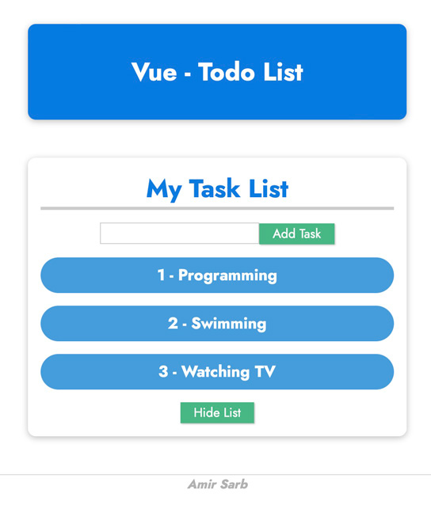

<div>
  <h1 align="center">Todo List - Task List in Vue.JS  🧑‍💻</h1>
<h2 style="">Goal:</h2>
  <ul>
  <li>

v-if | v-on | v-model | methods | data | v-for | v-show | v-bind

  </li>
  <li>
  Practicing data / methods / styling
  </li>
    
   </ul>

  <p>
    Screenshot:
  </p>

  <a href="">
    
  </a>
</div>

<hr />

## Requirements

- Vue 3

## Font

- Jost

## Main Part

`Todo List`

```javascript
const app = Vue.createApp({
  data() {
    return {
      userTasks: [],
      currentTask: "",
      listIsVisible: true,
    };
  },
  methods: {
    addTask(task) {
      this.userTasks.push(task);
      this.currentTask = "";
    },
    removeTask(index) {
      this.userTasks.splice(index, 1);
    },
    toggleVisibility() {
      this.listIsVisible = !this.listIsVisible;
    },
  },
});
app.mount("#user-tasks");
```

# Installation

No need to install any application, just open it via your browser and enjoy it!
